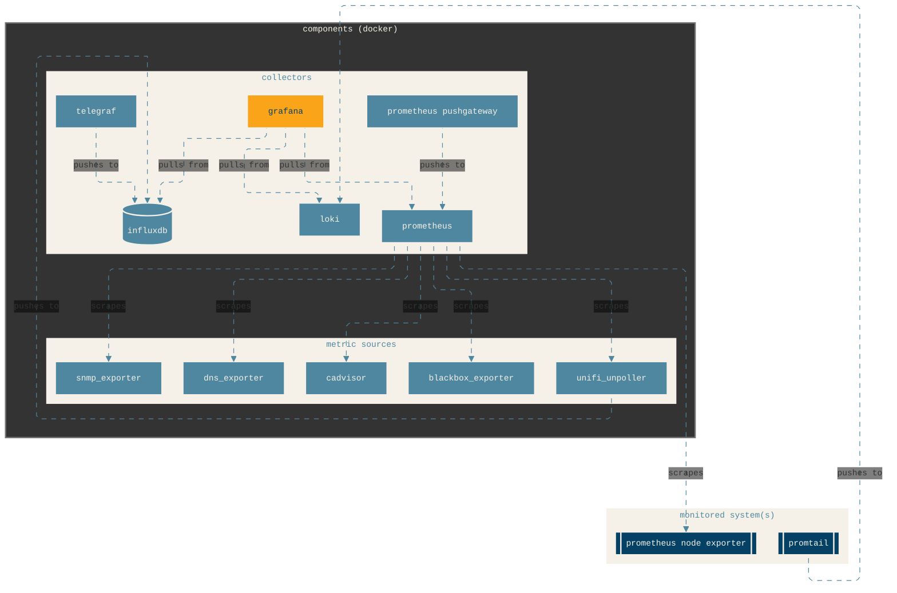

# Monitoring

An Ansible playbook that turns a single host into a self-contained monitoring stack (metrics, logs, network probes, and dashboards) running mostly in Docker containers.

## Overview



### Components

+ Collectors
  + `grafana`: A visualization and dashboarding platform used to query, visualize, and alert on metrics, logs, and traces from multiple data sources through a unified UI.
  + `influxdb`: A high-performance time-series database optimized for storing and querying metrics and event data with high write throughput.
  + `loki`: A log aggregation system designed to store and query logs efficiently by indexing metadata (labels) rather than log contents, tightly integrated with Grafana.
  + `prometheus`: A metrics collection and monitoring system that scrapes time-series data from instrumented targets, stores it locally, and supports powerful querying and alerting.
  + `prometheus pushgateway`: A component that allows short-lived or batch jobs to push metrics to Prometheus instead of being scraped directly.
  + `telegraf`: A lightweight, plugin-driven agent used to collect, process, and forward system, application, and infrastructure metrics to backends like InfluxDB or Prometheus.
  + `blackbox_exporter`: A Prometheus exporter that performs active probing (HTTP, HTTPS, TCP, ICMP, DNS) to measure availability and latency of external endpoints.
  + `dns_exporter`: A Prometheus exporter that performs DNS queries against specified resolvers or domains and exposes metrics such as query success, response time, and record validity to monitor DNS availability and performance.
  + `snmp_exporter`: A Prometheus exporter that scrapes metrics from network devices using SNMP and translates them into Prometheus-compatible metrics for monitoring switches, routers, firewalls, and other SNMP-enabled equipment.
  + `unifi_unpoller`: A Prometheus exporter that scrapes metrics from Unifi network devices and translates them into Prometheus-compatible metrics.

### Monitored system(s)

+ Agents
  + `cadvisor`: Container that collects performance metrics from local Docker daemon.
  + `promtail`: An agent that tails log files and systemd journals, enriches log entries with labels, and ships them to Loki for centralized log aggregation and querying.
  + `prometheus node exporter`: A Prometheus exporter that exposes host-level hardware and OS metrics such as CPU, memory, disk, filesystem, and network statistics from Linux and other Unix-like systems.

### Ports

| Component | Container port | External port |
| --------- | -------------- | ------------- |
| `blackbox_exporter` | 9115 | 9115 |
| `cadvisor` | 8080 | 9999 |
| `dns_exporter` | 15353 | 15353 |
| `grafana` | 3000 | 9003 |
| `influxdb` | 8086 | 8086 |
| `loki` | 3100 | 3100 |
| `prometheus node exporter` | 9100 | 9100 |
| `prometheus pushgateway` | 9091 | 9091 |
| `prometheus` | 9090 | 9090 |
| `promtail` | 9080 | 9080 |
| `snmp_exporter` | 9116 | 9116 |
| `telegraf` | 6514, 8092/udp, 8094, 8125/udp | 6514, 8092/udp, 8094, 8125/udp |
| `unifi_unpoller` | 9130 | 9130 |
| Docker metrics endpoint | 9323 | 9323 |

### Configuration files

The `files` directory contains configuration files for each component:

+ `files/blackbox.yml`: HTTP probe settings
+ `files/dns_exporter.yml`: DNS probe modules
+ `files/loki.yml`: single-node Loki storage and caching settings
+ `files/prometheus.yml`: scrape targets, blackbox and DNS probe jobs, SNMP modules, Pushgateway, and lab hosts
+ `files/promtail.yml`: log shipping paths and Loki client endpoint
+ `files/snmp.yml`: SNMP auth profiles and MIB walks for Synology and UniFi gear
+ `files/telegraf.conf`: syslog listener; forwards to InfluxDB with token from Vault
+ `files/up.conf`: UniFi Poller outputs (Prometheus + InfluxDB) and controller defaults

During playbook execution, the configuration files are copied from `files/` into `/containers/monitoring/` on the target host.

### Persistent volumes

Where applicable, Docker volumes persist data under `/containers/monitoring`.

## Requirements

+ Ubuntu or Debian based Linux server
+ Ansible 2.15+
  + `community.docker` Ansible collection

### Secrets

Secrets (passwords, tokens, etc.) for various components are retrieved from Hashicorp Vault via a local Vault Proxy:

| Vault path | Secret name | Purpose |
| ---------- | ----------- | ------- |
| `kv/data/monitoring/influxdb` | `DOCKER_INFLUXDB_INIT_ADMIN_TOKEN` | Administrator token for InfluxDB |
| `kv/data/monitoring/influxdb` | `DOCKER_INFLUXDB_INIT_USERNAME` | Administrator username for InfluxDB |
| `kv/data/monitoring/influxdb` | `DOCKER_INFLUXDB_INIT_PASSWORD` | Administrator password for InfluxDB |
| `kv/data/monitoring/telegraf` | `influxdb_token` | InfluxDB token for use by Telegraf |
| `kv/data/monitoring/unpoller` | `influxdb_user` | InfluxDB username for use by Unifi unpoller exporter |
| `kv/data/monitoring/unpoller` | `influxdb_pass` | InfluxDB password for use by Unifi unpoller exporter |

> [!NOTE]
> The [jaredmartin/vault](https://github.com/jaredmmartin/vault) repository contains a playbook for setting up a simple HashiCorp Vault instance and Vault Proxy

## Usage

To apply the playbook:

```bash
ansible-playbook main.yml
```

After applying the playbook, login to Grafana at `http://<ip>:9003`.

## Useful documentation

[Get started with Grafana and Prometheus](https://grafana.com/docs/grafana/latest/fundamentals/getting-started/first-dashboards/get-started-grafana-prometheus/)
